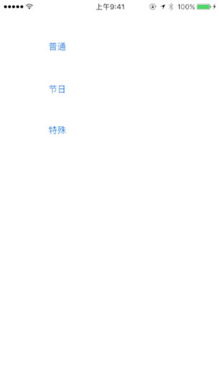
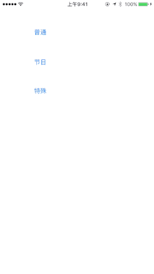
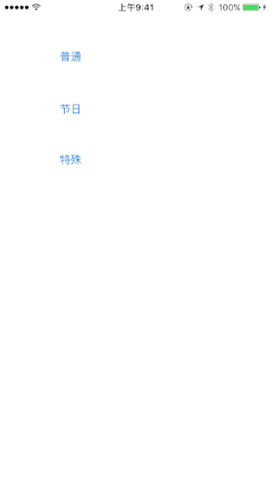

# WYLNotificationView
为公司封装的一个简单的吐司view(公司内部管这种view叫吐司...)

##效果图

##### 图1 普通吐司


##### 图2 节日吐司


##### 图3 特殊吐司


##Getting Start

**使用 [CocoaPods](http://cocoapods.org)**


1 . 添加 `pod WYLNotificationView` 到你的 [podfile](http://guides.cocoapods.org/using/the-podfile.html)

```
pod 'WYLNotificationView'
```

2 . 在终端运行 `pod install` 然后打开新生成的`xcworkspace`

3 . 在你需要添加的地方添加头文件 `WYLNotificationView.h`


**通过github集成**

1 . download`WYLNotificationView`文件夹,放入你的`project`中

2 . 在你需要添加的地方添加头文件 `WYLNotificationView.h`


##如何使用

1.在你的项目中的AppDelegate.h文件和任何你想发送吐司的文件里,import"WYLNotification.h"

2.如果你想发送普通的吐司需求,你可以写下如下代码.例如:

	- (BOOL)application:(UIApplication *)application didFinishLaunchingWithOptions:(NSDictionary *)launchOptions {
    // Override point for customization after application launch.
    
    [[NSNotificationCenter defaultCenter] addObserver:self selector:@selector(showTS:) name:kTSNotification object:nil];
    
    return YES;
	}

	- (void)showTS:(NSNotification *)not{
    
    NSDictionary *dict = [not userInfo];
    
    WYLNotificationView *view = [[WYLNotificationView alloc]init];
    
    view.window = self.window;
    view.tusiStr = [dict objectForKey:kTUCAOStr];
    view.height = self.window.frame.size.height / 10.0f;
    view.font = [UIFont systemFontOfSize:18];
    view.duration = [[dict objectForKey:kTUCAODuration] floatValue];
    
    [view createTuSi];

	}
	
我们将吐司的view添加到window上,然后使其可以在任意界面展示.如果你要发送,你只需要配置一个dict,然后post它即可,例如:

	- (IBAction)post:(id)sender {

    NSDictionary *dict = @{kTUCAOStr:[NSString stringWithFormat:@"这次的测试数字是 : %d",255 - (arc4random()%255)],kTUCAODuration:@(1)};
    
    [[NSNotificationCenter defaultCenter] postNotificationName:kTSNotification object:nil userInfo:dict];

	}
	
其中,`kTUCAOStr`是要发送字符串的key,`kTUCAODuration`是要展示的时间. 最后效果入 图1

3.如果你想发送类似节日的吐司需求,你可以写下如下代码.例如:

	- (BOOL)application:(UIApplication *)application didFinishLaunchingWithOptions:(NSDictionary *)launchOptions {
    // Override point for customization after application launch.
    
    [[NSNotificationCenter defaultCenter] addObserver:self selector:@selector(showHoliday:) name:kHolidayNotification object:nil];
       
    return YES;
	}
	
	- (void)showHoliday:(NSNotification *)not{
    
    for (int i = 0; i < 15; i++) {
        
        @autoreleasepool {
        
            UIImage *image = (UIImage *)[not object];
            
            int x = (arc4random()%(int)(self.window.frame.size.width)) - image.size.width;
            
            WYLHolidayNotificationView *view =[[WYLHolidayNotificationView alloc]initWithFrame:CGRectMake(x, -100, 50, 50)];
            view.size = self.window.frame.size;
            view.image = image;
            
            [self.window addSubview:view];
            [self.window bringSubviewToFront:view];
            
            [view startDropOut];
        
        }
    
    }
            
	}
	
你只需要把一个你想展示的图片文件传入dict然后发送出去即可,效果如图2.例如:
	
	- (IBAction)post2:(UIButton *)sender {
    
    UIImage *image = [UIImage imageNamed:@"girl"];
    
    [[NSNotificationCenter defaultCenter] postNotificationName:kHolidayNotification object:image userInfo:nil];
    
	}
	
4.如果你想发送带一个按钮的特殊需求,你可以写下如下代码.例如:

	- (BOOL)application:(UIApplication *)application didFinishLaunchingWithOptions:(NSDictionary *)launchOptions {
    // Override point for customization after application launch.
    
    [[NSNotificationCenter defaultCenter] addObserver:self selector:@selector(showSpecialNotification:) name:kTSSpecialNotification object:nil];
    
    return YES;
	}

	- (void)showSpecialNotification:(NSNotification *)not{
    
    NSDictionary *dict = [not userInfo];
    
    WYLSpecialNotificationView *view = [[WYLSpecialNotificationView alloc]init];
    
    view.window = self.window;
    view.tusiStr = [dict objectForKey:kTUCAOStr];
    view.height = self.window.frame.size.height / 10.0f;
    view.font = [UIFont systemFontOfSize:18];
    view.duration = [[dict objectForKey:kTUCAODuration] floatValue];
    view.btnStr = [dict objectForKey:kTUBtnStr];
    
    __weak WYLSpecialNotificationView *weakView = view;
    view.callBtn = ^{
        [weakView removeSelf];
    };
    
    [view createTuSi];
    [view createBtn];
	}
	
这次你除了要传一个展示的字符串,展示时间以外,你还需要传一个btn的按钮名字.效果如图3.例如

	- (IBAction)post3:(UIButton *)sender {

    NSDictionary *dict = @{kTUCAOStr:[NSString stringWithFormat:@"这次的测试数字是 : %d",255 - (arc4random()%255)],kTUCAODuration:@(1),kTUBtnStr:@"继续下载"};
    
    [[NSNotificationCenter defaultCenter] postNotificationName:kTSSpecialNotification object:nil userInfo:dict];
    
	}
	
注意:特殊吐司不会自己消失,而是添加了手势上滑消失,或者点击按钮消失.


#License
MIT